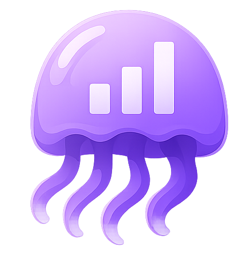
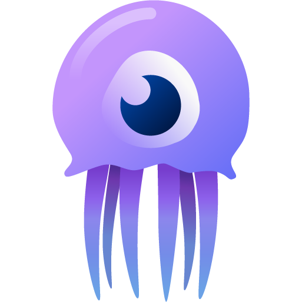

  

<h1 align="center">JellyGlance Documentation</h1>

  <strong>The documentation home for your Jellyfin command center.</strong> 
  Guides, walkthroughs, and technical references for the JellyGlance ecosystem.

  
  
  

  <a href="https://jellyglance.com/"><strong>Website</strong></a> ·
  <a href="http://docs.jellyglance.com/"><strong>Explore the docs</strong></a> ·
  <a href="https://github.com/JellyGlance/Documentation"><strong>Docs repository</strong></a> ·
  <a href="https://github.com/Nerdy-Technician/JellyGlance"><strong>JellyGlance</strong></a> ·
  <a href="https://github.com/JellyGlance/Documentation/issues"><strong>Documentation feedback</strong></a> ·
  <a href="https://discord.gg/dMGhv8j2kx"><strong>Discord</strong></a>

---

## Everything around your media server

JellyGlance brings Jellyfin sessions, libraries, users, requests, downloads, and server health into one dashboard. This repository is its dedicated documentation home, covering first installation through everyday operation and recovery.

   &nbsp;&nbsp;
   &nbsp;&nbsp;
   &nbsp;&nbsp;
   &nbsp;&nbsp;
   &nbsp;&nbsp;
   &nbsp;&nbsp;
   &nbsp;&nbsp;
   &nbsp;&nbsp;
  

## Inside the documentation

| Area | Coverage |
| --- | --- |
| **Getting started** | Installation, first-run setup, authentication, and common questions |
| **Your software stack** | Integration directory, software-specific walkthroughs, and connection details |
| **Dashboard experience** | Widgets, themes, layouts, kiosk displays, and annotated screenshots |
| **Networking** | HTTPS and reverse proxies with Nginx, Caddy, Nginx Proxy Manager, and Traefik |
| **Operations** | Backups, restore, updates, recovery, background tasks, and troubleshooting |
| **Notifications** | Discord, Gotify, ntfy, Telegram, and Pushover |
| **Technical reference** | Environment variables, permissions, API examples, and downloadable dashboard widgets |

---

  Created for <strong>JellyGlance</strong> by <strong>Nerdy-Technician</strong>. 
  <a href="LICENSE">License</a> 
