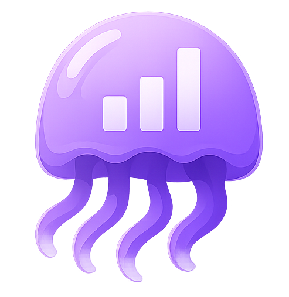

# { .page-brand } JellyGlance documentation

Learn how to install JellyGlance, connect Jellyfin or Emby, and manage your media stack. JellyGlance runs alongside the media server and brings sessions, users, requests, downloads, and server health into one dashboard.

<iframe src="https://www.youtube-nocookie.com/embed/IWa0RgbOogQ?start=2" title="JellyGlance trailer: a free, self-hosted dashboard for Jellyfin" allow="accelerometer; autoplay; clipboard-write; encrypted-media; gyroscope; picture-in-picture; web-share" allowfullscreen></iframe>

[Live documentation ↗](http://docs.jellyglance.com/)
[JellyGlance website ↗](https://jellyglance.com/)
[Application repo ↗](https://github.com/Nerdy-Technician/JellyGlance)
[Documentation repo ↗](https://github.com/JellyGlance/Documentation)

[ **Docker**](operations/docker.md)

[ **Jellyfin**](integrations.md#jellyfin)

[ **Emby**](integrations.md#emby)

[ **PostgreSQL**](guide/architecture.md)

[ **Sonarr**](integrations.md#arr-apps)

[ **Radarr**](integrations.md#arr-apps)

[ **Nginx**](operations/reverse-proxy.md)

[ **Homarr**](operations/widgets.md)

[ **Discord**](integrations.md#notifications)

## Get started

If this is your first installation, follow these steps:

1. **[Install JellyGlance](guide/getting-started.md#docker-start)** with Docker Compose and configure your database and application secrets.
2. **[Complete first setup](guide/getting-started.md#first-setup)** to connect Jellyfin or Emby, choose a login method, and run the initial sync.
3. **[Connect integrations](integrations.md)** for requests, downloads, calendars, and notifications.

!!! note "Before you begin"
    You need a running Jellyfin or Emby server, an API key for that server, and Docker with Compose v2. PostgreSQL is included in the example Compose stack.

## Installation and configuration

<a href="guide/getting-started/"><strong>Installation</strong>Requirements, Docker setup, and the first-run wizard</a>

<a href="operations/docker/"><strong>Docker</strong>Environment values, persistent storage, and updates</a>

<a href="installation/ugreen/"><strong>UGREEN NAS</strong>Follow Marius Hosting’s UGREEN guide</a>

<a href="installation/synology/"><strong>Synology NAS</strong>Follow Marius Hosting’s Synology guide</a>

<a href="installation/unraid/"><strong>Unraid and TrueNAS</strong>Community Apps on Unraid, and Compose on TrueNAS</a>

<a href="operations/reverse-proxy/"><strong>Reverse proxy</strong>HTTPS with Nginx Proxy Manager, Caddy, Nginx, or Traefik</a>

<a href="reference/configuration/"><strong>Configuration reference</strong>Environment variables, defaults, and first-run bootstrap</a>

<a href="guide/authentication/"><strong>Authentication</strong>Local accounts, Quick Connect, Emby sign-in, OIDC, and roles</a>

<a href="integrations/"><strong>Integrations</strong>Jellyfin or Emby, Seerr, Arr apps, downloads, and notifications</a>

## Using JellyGlance

<a href="guide/dashboard/"><strong>Dashboard and kiosk</strong>Annotated dashboard, layouts, themes, and wall displays</a>

<a href="operations/notifications/"><strong>Notifications</strong>Discord, Gotify, ntfy, Telegram, and Pushover</a>

<a href="guide/screenshots/"><strong>Screenshots</strong>Setup screens, dashboard pages, and settings</a>

<a href="operations/widgets/"><strong>Homepage and Homarr widgets</strong>API tokens, endpoints, and downloadable widget files</a>

<a href="operations/backup-restore/"><strong>Backup and restore</strong>Exports, retention, recovery, and moving servers</a>

<a href="operations/updates/"><strong>Updates and recovery</strong>Stable and beta channels, update checks, and recovery</a>

<a href="reference/tasks/"><strong>Background tasks</strong>What each task does, and how to read a failure</a>

<a href="reference/api-cookbook/"><strong>API cookbook</strong>Read-only requests and example JSON responses</a>

<a href="guide/architecture/"><strong>Architecture</strong>How the web app, API, database, and integrations fit</a>

## Troubleshooting

Use the [troubleshooting hub](guide/troubleshooting.md) for step-by-step diagnosis and log collection.

The [frequently asked questions](guide/faq.md) cover common installation and connection problems:

- [Jellyfin or Emby URL or API key will not validate](guide/faq.md#jellyfin)
- [First sync is stuck or the dashboard looks empty](guide/faq.md#sync)
- [Requests, Downloads, or Invites are missing](guide/faq.md#pages)
- [Homepage or Homarr returns 403](guide/faq.md#widgets)
- [Reverse proxy configuration](operations/reverse-proxy.md)

For further help, ask in [Discord](https://discord.gg/dMGhv8j2kx) or [open an issue on GitHub](https://github.com/Nerdy-Technician/JellyGlance/issues).

Documentation correction or suggestion? [Open a documentation issue](https://github.com/JellyGlance/Documentation/issues/new/choose).
