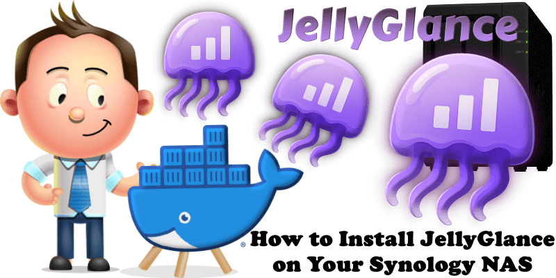

# { .page-brand } Install on a Synology NAS

Follow Marius Bogdan Lixandru’s illustrated guide. It is the Synology install path, with the Portainer screens and folder steps.

[{ .marius-cover }](https://mariushosting.com/how-to-install-jellyglance-on-your-synology-nas/)

**[How to Install JellyGlance on Your Synology NAS](https://mariushosting.com/how-to-install-jellyglance-on-your-synology-nas/)**

Thank you to Marius. More of his NAS write-ups are on [Marius Hosting](https://mariushosting.com/).

Replace the example database password, `JWT_SECRET`, and timezone in his Compose file before you start the stack. When the container is up, finish [first setup](../guide/getting-started.md#first-setup) with your Jellyfin URL and API key.
