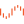

# { .page-brand } { .page-brand } Unraid and TrueNAS

JellyGlance is a Docker Compose app with PostgreSQL. On Unraid or TrueNAS, wrap that stack.

See [Docker](../operations/docker.md) for the compose file and the [FAQ](../guide/faq.md) for first-run, API keys, and proxy questions. UGREEN and Synology have their own install pages: [UGREEN NAS](ugreen.md) and [Synology NAS](synology.md).

## What you need

- JellyGlance sits **beside** Jellyfin. It is not a Seerr, Sonarr, or Jellyfin admin replacement.
- Requires a Jellyfin URL + API key and a PostgreSQL database.
- Web UI on container port `3000`.
- Persist `/app/config` and `/app/backups`.

## Unraid

Install from [JellyGlance on Unraid Community Apps](https://ca.unraid.net/apps/jellyglance-19yd57n0cdzexj).

Use the official image from GitHub Container Registry (`ghcr.io`) matching the [Docker](../operations/docker.md) compose file. Map:

- `3000` → host web port
- `./config` → `/app/config`
- `./backups` → `/app/backups`

Set `JWT_SECRET`, `POSTGRES_*`, and `TZ`. PostgreSQL can be a second Unraid container on the same Docker network.

## TrueNAS SCALE

Add a custom app from the same compose file, or two apps (API+web is already one Node process serving the built UI) plus PostgreSQL. Keep host path datasets for config and backups.

## Helm / Kubernetes

Not shipped. Reuse the compose environment variables as a Deployment + Service + PVC if you maintain your own chart.
