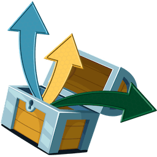
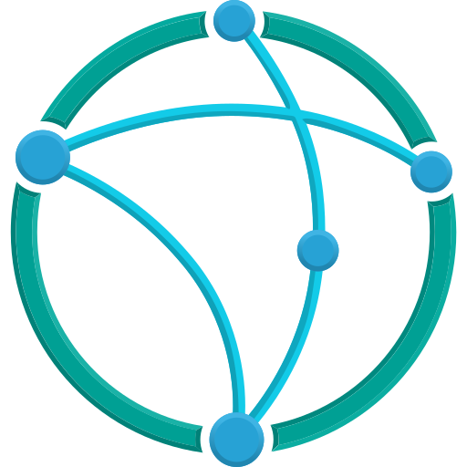

---
hide:
  - toc
---

THE JELLYGLANCE STACK

# Your apps. One place to manage them.

Connect Jellyfin first, then add the services you use. Browse by category to see what each integration does and where to configure it.

{ .directory-core-logo }

**Start with Jellyfin** Required connection

Connect your server URL and API key during [first setup](guide/getting-started.md#first-setup). Optional Requests, Downloads, Transcodes, and Invites pages appear when their services are configured.

<label class="faq-search-label" for="integration-search">Find your software</label>

<input id="integration-search" type="search" placeholder="Search Sonarr, requests, API keys…" autocomplete="off"><button class="directory-clear" type="button">Clear</button>

<button type="button" data-category="all" aria-pressed="true">All apps</button>
<button type="button" data-category="media-server" aria-pressed="false">Media server</button>
<button type="button" data-category="3rd-party-apps" aria-pressed="false">Media tools</button>
<button type="button" data-category="seerr-apps" aria-pressed="false">Requests</button>
<button type="button" data-category="arr-apps" aria-pressed="false">Automation</button>
<button type="button" data-category="download-clients" aria-pressed="false">Downloads</button>
<button type="button" data-category="notifications" aria-pressed="false">Notifications</button>
<button type="button" data-category="imports-and-digest" aria-pressed="false">Imports & email</button>

<section class="directory-section" data-category="media-server" markdown="1">

## Media server {#media-server}

Your library starts here

<article class="integration-card" id="jellyfin" markdown="1">

{ .integration-card-logo loading=lazy }

### Jellyfin

The required media server connection.

Configuration details

**Open:** First setup → Jellyfin

Configure it during first setup or under **Settings → Integrations → Media Server**.

- Validate the Jellyfin URL and API key.
- Sync libraries, users, items, seasons, episodes, and playback data.
- Proxy posters, backdrops, avatars, and login artwork.
- Read active sessions for Activity views and nav badges.
- Support Jellyfin Quick Connect login.

[Link to Jellyfin](#jellyfin)

[Setup walkthrough →](integrations/jellyfin.md){ .integration-guide-link }

</article>

</section>

<section class="directory-section" data-category="3rd-party-apps" markdown="1">

## Media tools {#3rd-party-apps}

Invites, transcodes & housekeeping

3rd party apps live under <strong>Settings &gt; Integrations &gt; 3rd Party Apps</strong> and bring invites, transcodes, cleanup, and alternative TV automation into JellyGlance.

<article class="integration-card" id="wizarr" markdown="1">

{ .integration-card-logo loading=lazy }

### Wizarr

Create, copy, open, sync, and manage invite links directly from JellyGlance.

Configuration details

**Open:** Settings → Integrations → 3rd Party Apps

[Link to Wizarr](#wizarr)

</article>

<article class="integration-card" id="tdarr" markdown="1">

{ .integration-card-logo loading=lazy }

### Tdarr

Track active transcodes, queued jobs, history, artwork, conversion details, and live progress.

Configuration details

**Open:** Settings → Integrations → 3rd Party Apps

[Link to Tdarr](#tdarr)

</article>

<article class="integration-card" id="maintainerr" markdown="1">

{ .integration-card-logo loading=lazy }

### Maintainerr

Monitor cleanup collections, scheduled actions, recent activity, storage state, health, and reclaimable space.

Configuration details

**Open:** Settings → Integrations → 3rd Party Apps

[Link to Maintainerr](#maintainerr)

</article>

<article class="integration-card" id="unpackerr" markdown="1">

{ .integration-card-logo loading=lazy }

### Unpackerr

Connect the Unpackerr URL so Glance can health-check extract status next to the download queue. There is no second Unpackerr console.

Configuration details

**Open:** Settings → Integrations → 3rd Party Apps

[Link to Unpackerr](#unpackerr)

</article>

<article class="integration-card" id="kometa" markdown="1">

{ .integration-card-logo loading=lazy }

### Kometa

Ping Kometa as a connected overlay/collection service. Status appears on item glance when the URL answers.

Configuration details

**Open:** Settings → Integrations → 3rd Party Apps

[Link to Kometa](#kometa)

</article>

<article class="integration-card" id="notifiarr" markdown="1">

{ .integration-card-logo loading=lazy }

### Notifiarr

Health-only. Connect the Notifiarr API so Glance can confirm the client is reachable. It does not replace Notifiarr's Discord tools.

Configuration details

**Open:** Settings → Integrations → 3rd Party Apps

[Link to Notifiarr](#notifiarr)

</article>

<article class="integration-card" id="recyclarr" markdown="1">

{ .integration-card-logo loading=lazy }

### Recyclarr

Health-only ping for a Recyclarr URL. Glance does not edit quality profiles.

Configuration details

**Open:** Settings → Integrations → 3rd Party Apps

[Link to Recyclarr](#recyclarr)

</article>

<article class="integration-card" id="autobrr" markdown="1">

{ .integration-card-logo loading=lazy }

### autobrr

Filter hits appear on Downloads next to the client queue. Glance does not configure autobrr filters.

Configuration details

**Open:** Settings → Integrations → 3rd Party Apps

[Link to autobrr](#autobrr)

</article>

<article class="integration-card" id="sickchill" markdown="1">

{ .integration-card-logo loading=lazy }

### SickChill

Connect and health-check SickChill as optional TV automation. It does not sync the JellyGlance release calendar (use Sonarr for that).

Configuration details

**Open:** Settings → Integrations → 3rd Party Apps

[Link to SickChill](#sickchill)

</article>

</section>

<section class="directory-section" data-category="seerr-apps" markdown="1">

## Requests {#seerr-apps}

Bring requests into your dashboard

Seerr apps live under <strong>Settings &gt; Integrations &gt; Seerr Apps</strong>. Enable Jellyseerr, Overseerr, or both, then add the base URL and API key for each service.

<article class="integration-card" id="jellyseerr" markdown="1">

{ .integration-card-logo loading=lazy }

### Jellyseerr

Bring request cards, poster metadata, requester context, availability checks, and approval actions into JellyGlance.

Configuration details

**Open:** Settings → Integrations → Seerr Apps

[Link to Jellyseerr](#jellyseerr)

[Setup walkthrough →](integrations/jellyseerr.md){ .integration-guide-link }

</article>

<article class="integration-card" id="overseerr" markdown="1">

{ .integration-card-logo loading=lazy }

### Overseerr

Handle request triage, source badges, status, and per-request actions without leaving the dashboard.

Configuration details

**Open:** Settings → Integrations → Seerr Apps

[Link to Overseerr](#overseerr)

[Setup walkthrough →](integrations/jellyseerr.md){ .integration-guide-link }

</article>

More about requests

Connected Seerr apps power the dedicated <strong>Requests</strong> page:

- poster-first request cards with requester, status, source, type, and request age
- fast filters for all, approved, available, failed, and partial requests
- search and newest, oldest, or status sorting
- request detail modal with movie, show, season, and episode context when the source provides it
- availability checks against Jellyfin so requests can show Available, Missing, or Partially available
- approve, decline, retry, mark available, and open-in-Seerr actions where the source supports them
- sidebar badge counts for request items that need attention

</section>

<section class="directory-section" data-category="arr-apps" markdown="1">

## Automation {#arr-apps}

Keep your media pipeline in view

Arr apps live under <strong>Settings &gt; Integrations &gt; Arr Apps</strong>. Each service accepts a base URL and API key, and the test action reports the app version when the service responds correctly.

<article class="integration-card" id="sonarr" markdown="1">

{ .integration-card-logo loading=lazy }

### Sonarr

Series automation for TV releases, monitored episodes, health checks, calendar entries, and import events.

Configuration details

**Open:** Settings → Integrations → Arr Apps

[Link to Sonarr](#sonarr)

[Setup walkthrough →](integrations/sonarr.md){ .integration-guide-link }

</article>

<article class="integration-card" id="radarr" markdown="1">

{ .integration-card-logo loading=lazy }

### Radarr

Movie automation for release dates, monitored items, health checks, calendar entries, and import events.

Configuration details

**Open:** Settings → Integrations → Arr Apps

[Link to Radarr](#radarr)

[Setup walkthrough →](integrations/radarr.md){ .integration-guide-link }

</article>

<article class="integration-card" id="lidarr" markdown="1">

{ .integration-card-logo loading=lazy }

### Lidarr

Music automation for release status, monitored artists and albums, calendar context, and health checks.

Configuration details

**Open:** Settings → Integrations → Arr Apps

[Link to Lidarr](#lidarr)

</article>

<article class="integration-card" id="readarr" markdown="1">

{ .integration-card-logo loading=lazy }

### Readarr

Book automation on the same Arr calendar as Lidarr. Connect the URL and API key; Glance does not become a second Readarr editor.

Configuration details

**Open:** Settings → Integrations → Arr Apps

[Link to Readarr](#readarr)

</article>

<article class="integration-card" id="bazarr" markdown="1">

{ .integration-card-logo loading=lazy }

### Bazarr

Subtitle automation status and health checks alongside the rest of the media stack.

Configuration details

**Open:** Settings → Integrations → Arr Apps

[Link to Bazarr](#bazarr)

</article>

<article class="integration-card" id="prowlarr" markdown="1">

{ .integration-card-logo loading=lazy }

### Prowlarr

Indexer health and connected app sync status alongside the rest of the media automation stack.

Configuration details

**Open:** Settings → Integrations → Arr Apps

[Link to Prowlarr](#prowlarr)

</article>

More about automation

Run <strong>Arr Calendar Sync</strong> from <strong>Settings &gt; Tasks</strong> when you want to force a fresh pull from Sonarr, Radarr, Lidarr, or Readarr.

</section>

<section class="directory-section" data-category="download-clients" markdown="1">

## Downloads {#download-clients}

Torrent & Usenet queues

Download clients live under <strong>Settings &gt; Integrations &gt; Download Clients</strong> and feed the dedicated <strong>Downloads</strong> page.

<article class="integration-card" id="qbittorrent" markdown="1">

{ .integration-card-logo loading=lazy }

### qBittorrent

Torrent queue monitoring with URL, username, and password credentials.

Configuration details

**Open:** Settings → Integrations → Download Clients

[Link to qBittorrent](#qbittorrent)

[Setup walkthrough →](integrations/download-clients.md){ .integration-guide-link }

</article>

<article class="integration-card" id="transmission" markdown="1">

{ .integration-card-logo loading=lazy }

### Transmission

Torrent queue monitoring with URL, username, and password. Supports add, pause, and remove.

Configuration details

**Open:** Settings → Integrations → Download Clients

[Link to Transmission](#transmission)

[Setup walkthrough →](integrations/download-clients.md){ .integration-guide-link }

</article>

<article class="integration-card" id="deluge" markdown="1">

{ .integration-card-logo loading=lazy }

### Deluge

Torrent queue monitoring with URL and password. Supports add, pause, and remove.

Configuration details

**Open:** Settings → Integrations → Download Clients

[Link to Deluge](#deluge)

[Setup walkthrough →](integrations/download-clients.md){ .integration-guide-link }

</article>

<article class="integration-card" id="sabnzbd" markdown="1">

{ .integration-card-logo loading=lazy }

### SABnzbd

Usenet queue monitoring with URL and API key credentials, including pause and remove.

Configuration details

**Open:** Settings → Integrations → Download Clients

[Link to SABnzbd](#sabnzbd)

[Setup walkthrough →](integrations/download-clients.md){ .integration-guide-link }

</article>

<article class="integration-card" id="nzbget" markdown="1">

{ .integration-card-logo loading=lazy }

### NZBGet

Usenet queue monitoring with URL and API key. Supports add, pause, and remove.

Configuration details

**Open:** Settings → Integrations → Download Clients

[Link to NZBGet](#nzbget)

[Setup walkthrough →](integrations/download-clients.md){ .integration-guide-link }

</article>

More about downloads

The Downloads page supports magnet links, torrent URLs, and torrent file uploads. Queue sync refreshes active, queued, completed, and failed state for qBittorrent, Transmission, Deluge, rTorrent, SABnzbd, and NZBGet.

</section>

<section class="directory-section" data-category="notifications" markdown="1">

## Notifications {#notifications}

Send updates where you need them

<article class="integration-card" id="discord-compatible" markdown="1">

{ .integration-card-logo loading=lazy }

### Discord-Compatible

Send JellyGlance events to Discord-style webhook endpoints for task, sync, media, and health updates.

Configuration details

**Open:** Settings → Webhooks

[Link to Discord-Compatible](#discord-compatible)

</article>

<article class="integration-card" id="gotify-style" markdown="1">

{ .integration-card-logo loading=lazy }

### Gotify-Style

Send operational alerts to Gotify-style webhook targets for self-hosted notification flows.

Configuration details

**Open:** Settings → Webhooks

[Link to Gotify-Style](#gotify-style)

</article>

<article class="integration-card" id="ntfy" markdown="1">

{ .integration-card-logo loading=lazy }

### ntfy

Send operational alerts to ntfy topic URLs such as `https://ntfy.sh/your-topic`.

Configuration details

**Open:** Settings → Webhooks

[Link to ntfy](#ntfy)

</article>

<article class="integration-card" id="telegram" markdown="1">

{ .integration-card-logo loading=lazy }

### Telegram

Send the same event set to a Telegram bot using the Bot API sendMessage URL with `chat_id`.

Configuration details

**Open:** Settings → Webhooks

[Link to Telegram](#telegram)

</article>

<article class="integration-card" id="pushover" markdown="1">

{ .integration-card-logo loading=lazy }

### Pushover

Send the same event set to Pushover using `https://api.pushover.net/1/messages.json?token=APP_TOKEN&user=USER_KEY`.

Configuration details

**Open:** Settings → Webhooks

[Link to Pushover](#pushover)

</article>

More about notifications

Common event groups include:

- task started, completed, and failed
- Jellyfin full sync and recently added sync
- playback reporting import completed or failed
- Arr calendar refresh
- download started, completed, or failed
- integration health warning
- library scan completed

</section>

<section class="directory-section" data-category="imports-and-digest" markdown="1">

## Imports & email {#imports-and-digest}

Keep your history. Share what’s new.

<article class="integration-card" id="tautulli-imports" markdown="1">

{ .integration-card-logo loading=lazy }

### Tautulli Imports

Upload backups, preview history, skip duplicates, and manually match unmatched watch history to current Jellyfin media.

Configuration details

**Open:** Settings → Imports

[Link to Tautulli Imports](#tautulli-imports)

</article>

<article class="integration-card" id="newsletter-digest" markdown="1">

{ .integration-card-logo loading=lazy }

### Newsletter Digest

Configure SMTP, generate previews, send tests, track send history, and deliver weekly or monthly JellyGlance summaries.

Configuration details

**Open:** Settings → Newsletter

[Link to Newsletter Digest](#newsletter-digest)

</article>

More about imports & email

Imported rows that cannot be matched automatically are surfaced in both <strong>Settings &gt; Imports</strong> and the <strong>Repair Hub</strong>.

Newsletter content includes recently added media, weekly watch stats, active viewers, and repair status.

</section>

## Access and background jobs {#access-and-jobs}

See the [task reference](reference/tasks.md) for the full job catalog and [notifications guide](operations/notifications.md) for destination setup.

**Jellyfin Quick Connect**
Users approve login from Jellyfin and inherit the JellyGlance role assigned on the Users page.

**Local JellyGlance Users**
Local accounts can be created for admin, manager, viewer, and custom role workflows.

**OIDC Authentication**
OIDC login uses an external identity provider and matches the identity to a Jellyfin user. See [authentication and permissions](guide/authentication.md).

### Background Jobs

| Task | Purpose |
| --- | --- |
| Recently Added Items Sync | Refreshes fresh Jellyfin media shelves |
| Complete Jellyfin Sync | Syncs users, libraries, items, seasons, episodes, and metadata |
| Playback Reporting Import | Imports Jellyfin Playback Reporting Plugin rows |
| Integration Sync | Refreshes connected integration status |
| Arr Calendar Sync | Pulls release calendar data from Sonarr, Radarr, Lidarr, and Readarr |
| Download Queue Sync | Pulls active download queues from connected clients |
| Integration Health Check | Tests connected integration health and updates health history |
| Webhook Health Check | Sends a test event through enabled task webhooks and records delivery status |
| Backup JellyGlance | Creates a JellyGlance backup |
| Refresh Dashboard Stats | Refreshes cached dashboard and statistics views |
| Clear Stale Task Logs | Marks interrupted task logs as stale |

No matching integrations. Try a different search or clear the category filter.

