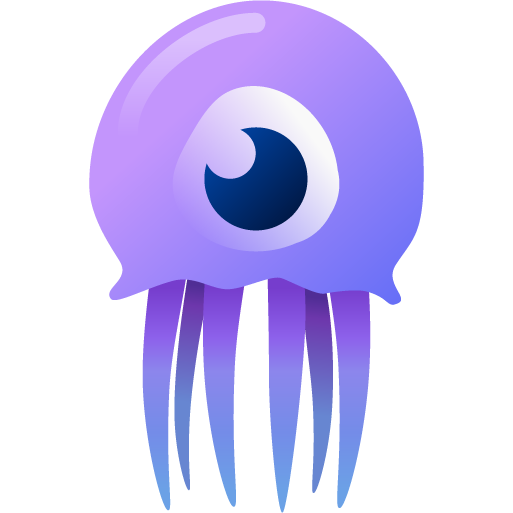
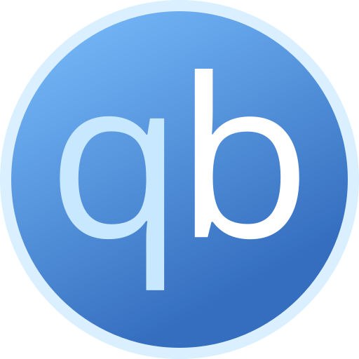

---
hide:
  - toc
---

THE JELLYGLANCE STACK

# Your apps. One place to manage them.

Connect Jellyfin or Emby first, then add the services you use. Browse by category to see what each integration does and where to configure it.

{ .directory-core-logo }

**Start with Jellyfin or Emby** Required connection

Connect one media server during [first setup](guide/getting-started.md#first-setup). JellyGlance can auto-detect which one the URL belongs to. Optional Requests, Downloads, Transcodes, and Invites pages appear when their services are configured.

<label class="faq-search-label" for="integration-search">Find your software</label>

<input id="integration-search" type="search" placeholder="Search Sonarr, requests, API keys…" autocomplete="off"><button class="directory-clear" type="button">Clear</button>

<button type="button" data-category="all" aria-pressed="true">All apps</button>
<button type="button" data-category="media-server" aria-pressed="false">Media server</button>
<button type="button" data-category="3rd-party-apps" aria-pressed="false">Media tools</button>
<button type="button" data-category="seerr-apps" aria-pressed="false">Requests</button>
<button type="button" data-category="arr-apps" aria-pressed="false">Automation</button>
<button type="button" data-category="download-clients" aria-pressed="false">Downloads</button>
<button type="button" data-category="notifications" aria-pressed="false">Notifications</button>
<button type="button" data-category="imports-and-digest" aria-pressed="false">Imports & email</button>

<section class="directory-section" data-category="media-server" markdown="1">

## Media server {#media-server}

Your library starts here

<article class="integration-card" id="jellyfin" markdown="1">

{ .integration-card-logo loading=lazy }

### Jellyfin

One of the two supported media servers. Jellyfin can sign people in with Quick Connect.

Configuration details

**Open:** First setup, or Settings → Integrations → Media Server

- Choose Jellyfin, or leave Auto-detect on.
- Validate the URL and API key. Default port is `8096`.
- Sync libraries, users, items, and playback. Quick Connect uses the Jellyfin account.

[Link to Jellyfin](#jellyfin)

[Setup walkthrough →](integrations/jellyfin.md){ .integration-guide-link }

</article>

<article class="integration-card" id="emby" markdown="1">

{ .integration-card-logo loading=lazy }

### Emby

The other supported media server. Emby signs in with a username and password. It does not use Quick Connect.

Configuration details

**Open:** First setup, or Settings → Integrations → Media Server

- Choose Emby, or leave Auto-detect on.
- Validate the URL and API key. Default port is `8096`.
- `IS_EMBY_API=true` locks the server type to Emby.

[Link to Emby](#emby)

[Setup walkthrough →](integrations/jellyfin.md){ .integration-guide-link }

</article>

</section>

<section class="directory-section" data-category="3rd-party-apps" markdown="1">

## Media tools {#3rd-party-apps}

Invites, transcodes & housekeeping

3rd party apps live under <strong>Settings &gt; Integrations &gt; 3rd Party Apps</strong>. They cover invites, transcodes, cleanup, audiobooks, and health checks for the rest of the stack. SickChill stays with the Arr apps as a TV alternative.

<article class="integration-card" id="wizarr" markdown="1">

{ .integration-card-logo loading=lazy }

### Wizarr

Create, copy, open, sync, and manage invite links directly from JellyGlance.

Configuration details

**Open:** Settings → Integrations → 3rd Party Apps

- Base URL and API key. Both are required.
- Test the connection, then save.
- **Invites** appears after Wizarr is connected.

[Link to Wizarr](#wizarr)

[Setup walkthrough →](integrations/wizarr.md){ .integration-guide-link }

</article>

<article class="integration-card" id="tdarr" markdown="1">

{ .integration-card-logo loading=lazy }

### Tdarr

Track active transcodes, queued jobs, history, artwork, conversion details, and live progress.

Configuration details

**Open:** Settings → Integrations → 3rd Party Apps

- Tdarr server URL, usually port `8266`. API key is optional unless Tdarr requires one.
- Test the connection, then save.
- **Active Transcodes** appears after Tdarr is connected.

[Link to Tdarr](#tdarr)

[Setup walkthrough →](integrations/tdarr.md){ .integration-guide-link }

</article>

<article class="integration-card" id="maintainerr" markdown="1">

{ .integration-card-logo loading=lazy }

### Maintainerr

Monitor cleanup collections, scheduled actions, recent activity, storage state, health, and reclaimable space.

Configuration details

**Open:** Settings → Integrations → 3rd Party Apps

- Base URL. API key is optional unless Maintainerr requires one.
- Test the connection, then save.
- The **Maintainerr** page appears after the URL is saved.

[Link to Maintainerr](#maintainerr)

[Setup walkthrough →](integrations/maintainerr.md){ .integration-guide-link }

</article>

<article class="integration-card" id="unpackerr" markdown="1">

{ .integration-card-logo loading=lazy }

### Unpackerr

Connect the Unpackerr URL so Glance can health-check extract status next to the download queue. There is no second Unpackerr console.

Configuration details

**Open:** Settings → Integrations → 3rd Party Apps

- URL that answers HTTP. API key is optional.
- Test confirms the URL responded. Extract rules stay in Unpackerr.

[Link to Unpackerr](#unpackerr)

[Setup walkthrough →](integrations/companion-apps.md#unpackerr){ .integration-guide-link }

</article>

<article class="integration-card" id="kometa" markdown="1">

{ .integration-card-logo loading=lazy }

### Kometa

Ping Kometa as a connected overlay/collection service. Status appears on item glance when the URL answers.

Configuration details

**Open:** Settings → Integrations → 3rd Party Apps

- URL that answers HTTP. API key is optional.
- A successful ping shows Kometa as connected on item glance.

[Link to Kometa](#kometa)

[Setup walkthrough →](integrations/companion-apps.md#kometa){ .integration-guide-link }

</article>

<article class="integration-card" id="notifiarr" markdown="1">

{ .integration-card-logo loading=lazy }

### Notifiarr

Health-only. Connect the Notifiarr API so Glance can confirm the client is reachable. It does not replace Notifiarr's Discord tools.

Configuration details

**Open:** Settings → Integrations → 3rd Party Apps

- API key is required. URL defaults to `https://notifiarr.com` for the hosted service.
- Test confirms the Notifiarr API accepted the key.

[Link to Notifiarr](#notifiarr)

[Setup walkthrough →](integrations/companion-apps.md#notifiarr){ .integration-guide-link }

</article>

<article class="integration-card" id="recyclarr" markdown="1">

{ .integration-card-logo loading=lazy }

### Recyclarr

Health-only ping for a Recyclarr URL. Glance does not edit quality profiles.

Configuration details

**Open:** Settings → Integrations → 3rd Party Apps

- URL that answers HTTP. API key is optional.
- Glance only pings that URL. It does not edit quality profiles.

[Link to Recyclarr](#recyclarr)

[Setup walkthrough →](integrations/companion-apps.md#recyclarr){ .integration-guide-link }

</article>

<article class="integration-card" id="autobrr" markdown="1">

{ .integration-card-logo loading=lazy }

### autobrr

Filter hits appear on Downloads next to the client queue. Glance does not configure autobrr filters.

Configuration details

**Open:** Settings → Integrations → 3rd Party Apps

- Base URL and API token. Both are required. Default port is `7474`.
- Recent filter hits show on **Downloads**. Filters stay in autobrr.

[Link to autobrr](#autobrr)

[Setup walkthrough →](integrations/companion-apps.md#autobrr){ .integration-guide-link }

</article>

<article class="integration-card" id="audiobookshelf" markdown="1">

{ .integration-card-logo loading=lazy }

### Audiobookshelf

Show who is listening, recent sessions, and newly added audiobooks.

Configuration details

**Open:** Settings → Integrations → 3rd Party Apps

- Base URL and an Audiobookshelf API token. Both are required.
- Create the token under Audiobookshelf **Settings → Users**.
- **Server → Audiobooks** appears after the URL is saved.

[Link to Audiobookshelf](#audiobookshelf)

[Setup walkthrough →](integrations/audiobookshelf.md){ .integration-guide-link }

</article>

</section>

<section class="directory-section" data-category="seerr-apps" markdown="1">

## Requests {#seerr-apps}

Bring requests into your dashboard

Seerr apps live under <strong>Settings &gt; Integrations &gt; Seerr Apps</strong>. Enable Jellyseerr, Overseerr, or both, then add the base URL and API key for each service.

<article class="integration-card" id="jellyseerr" markdown="1">

{ .integration-card-logo loading=lazy }

### Jellyseerr

Bring request cards, poster metadata, requester context, availability checks, and approval actions into JellyGlance.

Configuration details

**Open:** Settings → Integrations → Seerr Apps

- Base URL and the Seerr application API key. Default port is `5055`.
- Enable Jellyseerr, Overseerr, or both. Each one keeps its own URL and key.

[Link to Jellyseerr](#jellyseerr)

[Setup walkthrough →](integrations/jellyseerr.md){ .integration-guide-link }

</article>

<article class="integration-card" id="overseerr" markdown="1">

{ .integration-card-logo loading=lazy }

### Overseerr

Handle request triage, source badges, status, and per-request actions without leaving the dashboard.

Configuration details

**Open:** Settings → Integrations → Seerr Apps

- Base URL and the Overseerr application API key. Default port is `5055`.
- Use a separate card from Jellyseerr when both are running.

[Link to Overseerr](#overseerr)

[Setup walkthrough →](integrations/jellyseerr.md){ .integration-guide-link }

</article>

More about requests

Connected Seerr apps power the dedicated <strong>Requests</strong> page:

- poster-first request cards with requester, status, source, type, and request age
- fast filters for all, approved, available, failed, and partial requests
- search and newest, oldest, or status sorting
- request detail modal with movie, show, season, and episode context when the source provides it
- availability checks against Jellyfin so requests can show Available, Missing, or Partially available
- approve, decline, retry, mark available, and open-in-Seerr actions where the source supports them
- sidebar badge counts for request items that need attention

</section>

<section class="directory-section" data-category="arr-apps" markdown="1">

## Automation {#arr-apps}

Keep your media pipeline in view

Arr apps live under <strong>Settings &gt; Integrations &gt; Arr Apps</strong>. Each service accepts a base URL and API key, and the test action reports the app version when the service responds correctly.

<article class="integration-card" id="sonarr" markdown="1">

{ .integration-card-logo loading=lazy }

### Sonarr

Series automation for TV releases, monitored episodes, health checks, calendar entries, and import events.

Configuration details

**Open:** Settings → Integrations → Arr Apps

- Base URL and API key from Sonarr **Settings → General → Security**.
- Test the connection, then run **Arr Calendar Sync** when you want a fresh pull.

[Link to Sonarr](#sonarr)

[Setup walkthrough →](integrations/sonarr.md){ .integration-guide-link }

</article>

<article class="integration-card" id="radarr" markdown="1">

{ .integration-card-logo loading=lazy }

### Radarr

Movie automation for release dates, monitored items, health checks, calendar entries, and import events.

Configuration details

**Open:** Settings → Integrations → Arr Apps

- Base URL and API key from Radarr **Settings → General → Security**.
- Test the connection, then run **Arr Calendar Sync** when you want a fresh pull.

[Link to Radarr](#radarr)

[Setup walkthrough →](integrations/radarr.md){ .integration-guide-link }

</article>

<article class="integration-card" id="lidarr" markdown="1">

{ .integration-card-logo loading=lazy }

### Lidarr

Music automation for release status, monitored artists and albums, calendar context, and health checks.

Configuration details

**Open:** Settings → Integrations → Arr Apps

- Base URL and API key. Default port is `8686`.
- Album dates land on **Calendar** after **Arr Calendar Sync**.

[Link to Lidarr](#lidarr)

[Setup walkthrough →](integrations/lidarr.md){ .integration-guide-link }

</article>

<article class="integration-card" id="readarr" markdown="1">

{ .integration-card-logo loading=lazy }

### Readarr

Book automation on the same Arr calendar as Lidarr. Connect the URL and API key; Glance does not become a second Readarr editor.

Configuration details

**Open:** Settings → Integrations → Arr Apps

- Base URL and API key. Default port is `8787`.
- Book dates share the **Calendar** with Lidarr after **Arr Calendar Sync**.

[Link to Readarr](#readarr)

[Setup walkthrough →](integrations/readarr.md){ .integration-guide-link }

</article>

<article class="integration-card" id="bazarr" markdown="1">

{ .integration-card-logo loading=lazy }

### Bazarr

Subtitle automation status and health checks alongside the rest of the media stack.

Configuration details

**Open:** Settings → Integrations → Arr Apps

- Base URL and API key from Bazarr **Settings → General**. Default port is `6767`.
- Status shows on **Automation Health**. Bazarr does not fill the calendar.

[Link to Bazarr](#bazarr)

[Setup walkthrough →](integrations/bazarr.md){ .integration-guide-link }

</article>

<article class="integration-card" id="prowlarr" markdown="1">

{ .integration-card-logo loading=lazy }

### Prowlarr

Indexer health and connected app sync status alongside the rest of the media automation stack.

Configuration details

**Open:** Settings → Integrations → Arr Apps

- Base URL and API key from Prowlarr **Settings → General → Security**. Default port is `9696`.
- Indexer status shows on **Automation Health**.

[Link to Prowlarr](#prowlarr)

[Setup walkthrough →](integrations/prowlarr.md){ .integration-guide-link }

</article>

<article class="integration-card" id="sickchill" markdown="1">

{ .integration-card-logo loading=lazy }

### SickChill

Connect and health-check SickChill as optional TV automation. It does not sync the JellyGlance release calendar (use Sonarr for that).

Configuration details

**Open:** Settings → Integrations → Arr Apps → TV alternative

- Base URL and SickChill API key.
- You can set it as the preferred TV agent. Episode dates still come from Sonarr.

[Link to SickChill](#sickchill)

[Setup walkthrough →](integrations/sickchill.md){ .integration-guide-link }

</article>

More about automation

Run <strong>Arr Calendar Sync</strong> from <strong>Settings &gt; Tasks</strong> when you want to force a fresh pull from Sonarr, Radarr, Lidarr, or Readarr.

</section>

<section class="directory-section" data-category="download-clients" markdown="1">

## Downloads {#download-clients}

Torrent & Usenet queues

Download clients live under <strong>Settings &gt; Integrations &gt; Download Clients</strong> and feed the dedicated <strong>Downloads</strong> page.

<article class="integration-card" id="qbittorrent" markdown="1">

{ .integration-card-logo loading=lazy }

### qBittorrent

Torrent queue monitoring with URL, username, and password credentials.

Configuration details

**Open:** Settings → Integrations → Download Clients

- Web UI URL, username, and password.
- Add the client from the Download Clients list, test, then save.

[Link to qBittorrent](#qbittorrent)

[Setup walkthrough →](integrations/download-clients.md){ .integration-guide-link }

</article>

<article class="integration-card" id="transmission" markdown="1">

{ .integration-card-logo loading=lazy }

### Transmission

Torrent queue monitoring with URL, username, and password. Supports add, pause, and remove.

Configuration details

**Open:** Settings → Integrations → Download Clients

- Service URL, username, and password.
- Supports add, pause, and remove after **Download Queue Sync**.

[Link to Transmission](#transmission)

[Setup walkthrough →](integrations/download-clients.md){ .integration-guide-link }

</article>

<article class="integration-card" id="deluge" markdown="1">

{ .integration-card-logo loading=lazy }

### Deluge

Torrent queue monitoring with URL and password. Supports add, pause, and remove.

Configuration details

**Open:** Settings → Integrations → Download Clients

- Web UI URL and password.
- Supports add, pause, and remove after **Download Queue Sync**.

[Link to Deluge](#deluge)

[Setup walkthrough →](integrations/download-clients.md){ .integration-guide-link }

</article>

<article class="integration-card" id="sabnzbd" markdown="1">

{ .integration-card-logo loading=lazy }

### SABnzbd

Usenet queue monitoring with URL and API key credentials, including pause and remove.

Configuration details

**Open:** Settings → Integrations → Download Clients

- Service URL and API key.
- Supports pause and remove after **Download Queue Sync**.

[Link to SABnzbd](#sabnzbd)

[Setup walkthrough →](integrations/download-clients.md){ .integration-guide-link }

</article>

<article class="integration-card" id="nzbget" markdown="1">

{ .integration-card-logo loading=lazy }

### NZBGet

Usenet queue monitoring with URL and API key. Supports add, pause, and remove.

Configuration details

**Open:** Settings → Integrations → Download Clients

- Service URL, plus the Restricted username and password from NZBGet **Settings → Security**.
- Supports add, pause, and remove after **Download Queue Sync**.

[Link to NZBGet](#nzbget)

[Setup walkthrough →](integrations/download-clients.md){ .integration-guide-link }

</article>

<article class="integration-card" id="rtorrent" markdown="1">

{ .integration-card-logo loading=lazy }

### rTorrent

Torrent queue monitoring through XML-RPC, with username and password. Supports add, pause, and remove.

Configuration details

**Open:** Settings → Integrations → Download Clients

- HTTP URL of the XML-RPC endpoint, plus username and password.
- JellyGlance tries `/RPC2` on that URL, then the URL itself.
- A bare SCGI socket needs an HTTP front end such as ruTorrent first.

[Link to rTorrent](#rtorrent)

[Setup walkthrough →](integrations/download-clients.md){ .integration-guide-link }

</article>

More about downloads

The Downloads page supports magnet links, torrent URLs, and torrent file uploads. Queue sync refreshes active, queued, completed, and failed state for qBittorrent, Transmission, Deluge, rTorrent, SABnzbd, and NZBGet.

</section>

<section class="directory-section" data-category="notifications" markdown="1">

## Notifications {#notifications}

Send updates where you need them

<article class="integration-card" id="discord-compatible" markdown="1">

{ .integration-card-logo loading=lazy }

### Discord-Compatible

Send JellyGlance events to Discord-style webhook endpoints for task, sync, media, and health updates.

Configuration details

**Open:** Settings → Webhooks

- Discord incoming webhook URL for the channel that should receive events.
- Choose events, save, and send a test.

[Link to Discord-Compatible](#discord-compatible)

[Setup walkthrough →](operations/notifications.md){ .integration-guide-link }

</article>

<article class="integration-card" id="gotify-style" markdown="1">

{ .integration-card-logo loading=lazy }

### Gotify-Style

Send operational alerts to Gotify-style webhook targets for self-hosted notification flows.

Configuration details

**Open:** Settings → Webhooks

- Gotify application token on the `/message` URL.
- Add a test send and confirm it in delivery history.

[Link to Gotify-Style](#gotify-style)

[Setup walkthrough →](operations/notifications.md){ .integration-guide-link }

</article>

<article class="integration-card" id="ntfy" markdown="1">

{ .integration-card-logo loading=lazy }

### ntfy

Send operational alerts to ntfy topic URLs such as `https://ntfy.sh/your-topic`.

Configuration details

**Open:** Settings → Webhooks

- Topic URL such as `https://ntfy.sh/your-topic`.
- For a protected topic, add an `Authorization: Bearer` header.

[Link to ntfy](#ntfy)

[Setup walkthrough →](operations/notifications.md){ .integration-guide-link }

</article>

<article class="integration-card" id="telegram" markdown="1">

{ .integration-card-logo loading=lazy }

### Telegram

Send the same event set to a Telegram bot using the Bot API sendMessage URL with `chat_id`.

Configuration details

**Open:** Settings → Webhooks

- Bot API `sendMessage` URL with the bot token and `chat_id`.
- The bot must be allowed to post in that chat.

[Link to Telegram](#telegram)

[Setup walkthrough →](operations/notifications.md){ .integration-guide-link }

</article>

<article class="integration-card" id="pushover" markdown="1">

{ .integration-card-logo loading=lazy }

### Pushover

Send the same event set to Pushover using `https://api.pushover.net/1/messages.json?token=APP_TOKEN&user=USER_KEY`.

Configuration details

**Open:** Settings → Webhooks

- `https://api.pushover.net/1/messages.json?token=APP_TOKEN&user=USER_KEY`
- Keep the full URL private and confirm delivery with the test action.

[Link to Pushover](#pushover)

[Setup walkthrough →](operations/notifications.md){ .integration-guide-link }

</article>

More about notifications

Common event groups include:

- task started, completed, and failed
- Jellyfin full sync and recently added sync
- playback reporting import completed or failed
- Arr calendar refresh
- download started, completed, or failed
- integration health warning
- library scan completed

</section>

<section class="directory-section" data-category="imports-and-digest" markdown="1">

## Imports & email {#imports-and-digest}

Keep your history. Share what’s new.

<article class="integration-card" id="tautulli-imports" markdown="1">

{ .integration-card-logo loading=lazy }

### Tautulli Imports

Upload backups, preview history, skip duplicates, and manually match unmatched watch history to current Jellyfin media.

Configuration details

**Open:** Settings → Imports → Tautulli

- Upload a Tautulli backup, preview it, then import.
- Match leftover users and titles to current Jellyfin media. Existing Glance rows are kept.

[Link to Tautulli Imports](#tautulli-imports)

[Setup walkthrough →](integrations/imports.md#tautulli){ .integration-guide-link }

</article>

<article class="integration-card" id="jellystat-imports" markdown="1">

{ .integration-card-logo loading=lazy }

### Jellystat Imports

Upload a Jellystat backup, preview history, and match leftover users to current Jellyfin accounts.

Configuration details

**Open:** Settings → Imports → Jellystat

- Upload a Jellystat backup and review the preview before importing.
- Match unmatched users to Jellyfin users. Existing Glance rows are kept.

[Link to Jellystat Imports](#jellystat-imports)

[Setup walkthrough →](integrations/imports.md#jellystat){ .integration-guide-link }

</article>

<article class="integration-card" id="jellyfin-history" markdown="1">

{ .integration-card-logo loading=lazy }

### Media server history

Read played and in-progress items from the connected Jellyfin or Emby server. No Playback Reporting plugin is required.

Configuration details

**Open:** Settings → Imports → Jellyfin

- Preview, then sync selected users. Existing history rows are skipped.
- Optional automatic sync on a 6-hour, 12-hour, daily, or weekly interval.

[Link to media server history](#jellyfin-history)

[Setup walkthrough →](integrations/imports.md#jellyfin-history){ .integration-guide-link }

</article>

<article class="integration-card" id="trakt" markdown="1">

{ .integration-card-logo loading=lazy }

### Trakt

Link Trakt accounts to media-server users and import watch history with a device code or a file upload.

Configuration details

**Open:** Settings → Imports → Trakt

- Save a Trakt client ID and secret. Redirect URI is `urn:ietf:wg:oauth:2.0:oob`.
- Each Trakt account maps to one Jellyfin or Emby user.

[Link to Trakt](#trakt)

[Setup walkthrough →](integrations/imports.md#trakt){ .integration-guide-link }

</article>

<article class="integration-card" id="newsletter-digest" markdown="1">

{ .integration-card-logo loading=lazy }

### Newsletter Digest

Configure SMTP, generate previews, send tests, track send history, and deliver weekly or monthly JellyGlance summaries.

Configuration details

**Open:** Settings → Newsletter

- SMTP host, port, username, password, and sender address.
- Preview a digest, send a test, then schedule weekly or monthly delivery.

[Link to Newsletter Digest](#newsletter-digest)

[Setup walkthrough →](integrations/newsletter.md){ .integration-guide-link }

</article>

More about imports & email

Imported rows that cannot be matched automatically are surfaced in both <strong>Settings &gt; Imports</strong> and <strong>Repair</strong>. Tautulli covers title and user matching. Jellystat covers user matching. Trakt links each account to one media-server user. The Jellyfin import tab reads play state from the connected server.

Newsletter content includes recently added media, weekly watch stats, active viewers, and repair status.

</section>

## Access and background jobs {#access-and-jobs}

See the [task reference](reference/tasks.md) for the full job catalog and [notifications guide](operations/notifications.md) for destination setup.

**Jellyfin Quick Connect**
Users approve login from Jellyfin and inherit the JellyGlance role assigned on the Users page.

**Local JellyGlance Users**
Local accounts can be created for admin, manager, viewer, and custom role workflows.

**OIDC Authentication**
OIDC login uses an external identity provider and matches the identity to a Jellyfin user. See [authentication and permissions](guide/authentication.md).

### Background Jobs

| Task | Purpose |
| --- | --- |
| Recently Added Items Sync | Refreshes fresh Jellyfin media shelves |
| Complete Jellyfin Sync | Syncs users, libraries, items, seasons, episodes, and metadata |
| Playback Reporting Import | Imports Jellyfin Playback Reporting Plugin rows |
| Integration Sync | Refreshes connected integration status |
| Arr Calendar Sync | Pulls release calendar data from Sonarr, Radarr, Lidarr, and Readarr |
| Download Queue Sync | Pulls active download queues from connected clients |
| Integration Health Check | Tests connected integration health and updates health history |
| Webhook Health Check | Sends a test event through enabled task webhooks and records delivery status |
| Backup JellyGlance | Creates a JellyGlance backup |
| Refresh Dashboard Stats | Refreshes cached dashboard and statistics views |
| Clear Stale Task Logs | Marks interrupted task logs as stale |

No matching integrations. Try a different search or clear the category filter.

