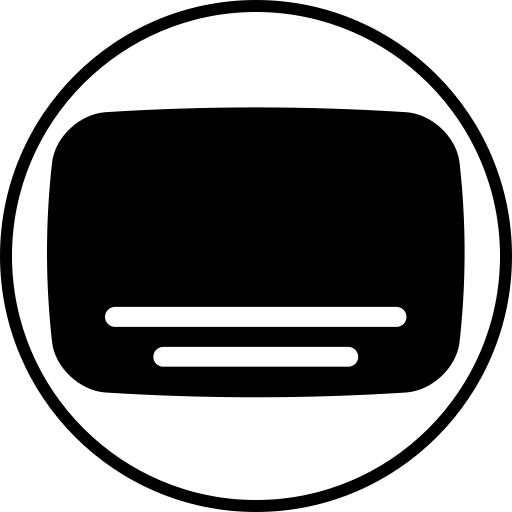

# { .page-brand } Connect Bazarr

Show subtitle automation health next to the rest of the media stack. Bazarr does not fill the JellyGlance release calendar.

## Before you begin

- Finish Bazarr's own setup and confirm it can see Sonarr or Radarr.
- Sign in to JellyGlance with permission to manage integrations.
- Have the API key under Bazarr **Settings → General**.

## Choose the connection URL

=== "Shared Docker network"

    ```text
    http://bazarr:6767
    ```

    `6767` is Bazarr's default port. Both containers must share a Docker network.

=== "LAN or NAS"

    ```text
    http://192.168.1.50:6767
    ```

    Use the address the JellyGlance container can reach. `localhost` inside JellyGlance is JellyGlance itself.

=== "Reverse proxy"

    ```text
    https://bazarr.example.com
    ```

    Include a path prefix if Bazarr is served under one. A proxy login page can block the API.

## Configure JellyGlance

1. Open **Settings → Integrations → Arr Apps**. Enable **Bazarr**.
2. Enter the base URL and API key.
3. Run the connection test. A successful test reports the Bazarr version.
4. Save the integration.
5. Open **Automation Health** and confirm Bazarr is listed with the other automation services.

Subtitle languages, providers, and Sonarr or Radarr links stay in Bazarr. JellyGlance reads status; it does not edit those settings.

## Common connection problems

| Symptom | Next check |
| --- | --- |
| Connection refused | Correct host and port; Bazarr running; container networking. |
| `401` or `403` | API key from Bazarr General settings, with no extra spaces. |
| `404` | Base URL only. Remove `/settings` or other UI paths. |
| Test succeeds but Automation Health is empty | Integration is saved and enabled, then open **Automation Health** again. |

See [Prowlarr](prowlarr.md) for indexer health on the same page, and [troubleshooting](../guide/troubleshooting.md) for log collection.
