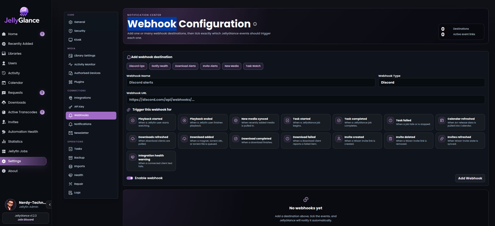

# { .page-brand } Notifications and webhooks

Send JellyGlance events to Discord, Gotify, ntfy, Telegram, or another supported destination. Configure these under **Settings → Webhooks**.

## Create a destination

1. Add a webhook and give it a descriptive name, such as `Discord — server health`.
2. Select the destination type and enter its URL.
3. Enable the events you need. Start with a small selection so important alerts are easy to notice.
4. Add required headers, save, and use the webhook's **Test** action.
5. Confirm delivery in both JellyGlance's delivery history and the destination app.



*Select a destination, configure its URL, and choose the events it should receive. Names and example values vary by installation.*

## Destination setup

=== "Discord"

    Create or obtain a Discord incoming webhook for the intended channel. Select **Discord** in JellyGlance and paste its complete URL:

    ```text
    https://discord.com/api/webhooks/WEBHOOK_ID/WEBHOOK_TOKEN
    ```

    The URL itself grants permission to post. Do not paste it into public logs or issues. Send a test and confirm it reaches the correct channel.

=== "Gotify"

    Create an application in Gotify and copy its application token. Select **Gotify** and use the message endpoint:

    ```text
    https://gotify.example.com/message?token=APP_TOKEN
    ```

    Use an application token, not a client token. If using public image cards, the destination must be able to reach the configured `JS_PUBLIC_URL`; see [configuration](../reference/configuration.md#reverse-proxy-and-public-urls).

=== "ntfy"

    Select **ntfy** and enter the topic URL you subscribe to:

    ```text
    https://ntfy.example.com/jellyglance
    ```

    For a protected server/topic, add an `Authorization` header with value `Bearer YOUR_ACCESS_TOKEN` using the webhook's Headers setting. Confirm the token can publish to that topic. Subscribe in ntfy before testing. See the upstream [publishing documentation](https://docs.ntfy.sh/publish/) for topic authentication.

=== "Telegram"

    Obtain a bot token and the destination chat ID. Make sure the bot can message that chat. Select **Telegram** and use:

    ```text
    https://api.telegram.org/botBOT_TOKEN/sendMessage?chat_id=CHAT_ID
    ```

    Replace both placeholders. For a group, verify the bot belongs to the intended group and has permission to send messages. The bot token is secret even though it appears in the URL.

=== "Pushover"

    Select **Pushover** and supply the application token and destination user key:

    ```text
    https://api.pushover.net/1/messages.json?token=APP_TOKEN&user=USER_KEY
    ```

    Keep the full URL private and verify delivery with the test action.

## Choose useful events

| Need | Events to consider |
| --- | --- |
| Know when something fails | Health and task failure events |
| Track new media | Media-added and import events |
| Follow requests/downloads | Request changes, download completion, and download failures |
| Confirm maintenance | Backup and task completion events |
| Monitor access invitations | Invite-related events when Wizarr is configured |

Available event choices come from the application's event picker. Review quiet hours and card appearance settings as well. Keep separate destinations if operational alerts and new-media notices belong in different channels.

## Diagnose delivery failures

- **Test fails immediately:** verify URL, credentials, destination type, and network access from the app container.
- **Test succeeds but an event does not arrive:** confirm that event is enabled, the webhook is enabled, and quiet hours do not explain the result.
- **Provider returns `401` / `403`:** check token type, permissions, and revocation.
- **Provider returns `429`:** reduce event volume and inspect provider rate-limit guidance.
- **Image missing but text arrives:** inspect the image URL and whether the receiving service can fetch it.

The **Webhook Health Check** task sends a test task-completed event through enabled task webhooks; it is not a universal test of every event selection. See [task reference](../reference/tasks.md).
