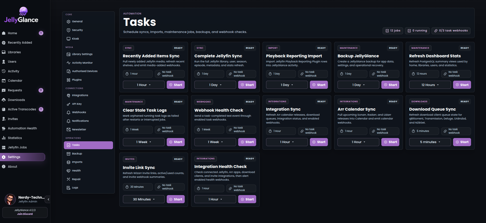

# Background tasks

Use **Settings → Tasks** to inspect jobs, run a task manually, and configure the scheduling options exposed by your installation. Review the task log after each manual run.

*Use the task's status and log to distinguish a completed run from a queued, interrupted, or failed job.*

## Task catalog

Names below match the application's task picker. The internal key is useful when interpreting logs.

| Task | Internal key | What it does |
| --- | --- | --- |
| Recently Added Items Sync | `PartialJellyfinSync` | Pull newly added Jellyfin media, refresh recent shelves, and emit media-added webhooks. |
| Complete Jellyfin Sync | `JellyfinSync` | Run the full Jellyfin library, user, season, episode, metadata, and stats refresh. |
| Playback Reporting Import | `JellyfinPlaybackReportingPluginSync` | Import Jellyfin Playback Reporting Plugin rows into JellyGlance activity. |
| Backup JellyGlance | `Backup` | Create a JellyGlance backup for app data, settings, and operational recovery. |
| Refresh Dashboard Stats | `RefreshDashboardStats` | Refresh PostgreSQL summary views used by home, libraries, users, and statistics. |
| Clear Stale Task Logs | `ClearStaleTasks` | Mark orphaned running task logs as failed after restarts or interrupted jobs. |
| Webhook Health Check | `WebhookHealthCheck` | Send a task-completed test event through enabled task webhooks. |
| Integration Sync | `IntegrationSync` | Refresh Arr calendar releases, download queues, integration status, and enabled webhooks. |
| Arr Calendar Sync | `ArrCalendarSync` | Pull upcoming Sonarr, Radarr, and Lidarr releases into Calendar and emit calendar webhooks. |
| Download Queue Sync | `DownloadQueueSync` | Refresh download client queue state for qBittorrent, Transmission, Deluge, SABnzbd, and NZBGet. |
| Invite Link Sync | `InviteSync` | Refresh Wizarr invite links, active/used counts, and invite webhook summaries. |
| Integration Health Check | `IntegrationHealthCheck` | Check connected Jellyfin, Arr apps, download clients, and invite integrations, then alert enabled health webhooks. |

Two additional backend tasks are registered:

| Task | Internal key | How to use it |
| --- | --- | --- |
| Restore | `Restore` | Use the Backup restore flow. Do not schedule destructive restores. |
| Newsletter Campaigns | `NewsletterCampaigns` | Processes configured newsletter campaigns; configure recipients and campaign timing through Newsletter settings. |

## Which task should I run?

| Situation | Start with |
| --- | --- |
| New install or incomplete library/user metadata | Complete Jellyfin Sync |
| New media is missing from recent shelves | Recently Added Items Sync |
| Old Playback Reporting history is missing | Playback Reporting Import, after checking the Jellyfin plugin |
| Metadata exists but summary numbers are stale | Refresh Dashboard Stats |
| Upcoming releases are stale | Arr Calendar Sync |
| Download progress is stale | Download Queue Sync |
| Wizarr invitations are stale | Invite Link Sync |
| Services appear offline | Integration Health Check |
| Logs still say Running after a restart | Inspect the job, then Clear Stale Task Logs for orphaned records |
| Preparing an upgrade | Backup JellyGlance and verify the resulting export |

Full sync is more work than a targeted refresh. Do not repeatedly launch full sync to fix a connection failure.

## Scheduling

1. Verify the integration or source service works before scheduling its task.
2. Run the task once manually and read the log.
3. Choose a schedule appropriate to the size of the library and how often the data changes.
4. Avoid overlapping expensive syncs, imports, and backups.
5. Review execution duration and failures after the next scheduled run.

There is no universal interval suitable for every server. Use the values shown by your running version and adjust based on observed load. The current backup implementation retains only five JSON files locally; see [backup retention](../operations/backup-restore.md#scheduling-and-retention).

## Application tasks versus Jellyfin jobs

JellyGlance tasks refresh its own data and integrations. **Jellyfin Jobs** controls scheduled jobs on the Jellyfin server itself. Starting a Jellyfin library scan is not the same as importing that library's metadata into JellyGlance.

## Failure diagnosis

Read the first meaningful error, not only the final Failed status. Check source URLs, API keys, database access, filesystem permissions, and disk space as appropriate to the task. A stale-log cleanup changes log state; it does not restart or repair the underlying job.

See [troubleshooting](../guide/troubleshooting.md), [notifications](../operations/notifications.md), and [backup and restore](../operations/backup-restore.md).
